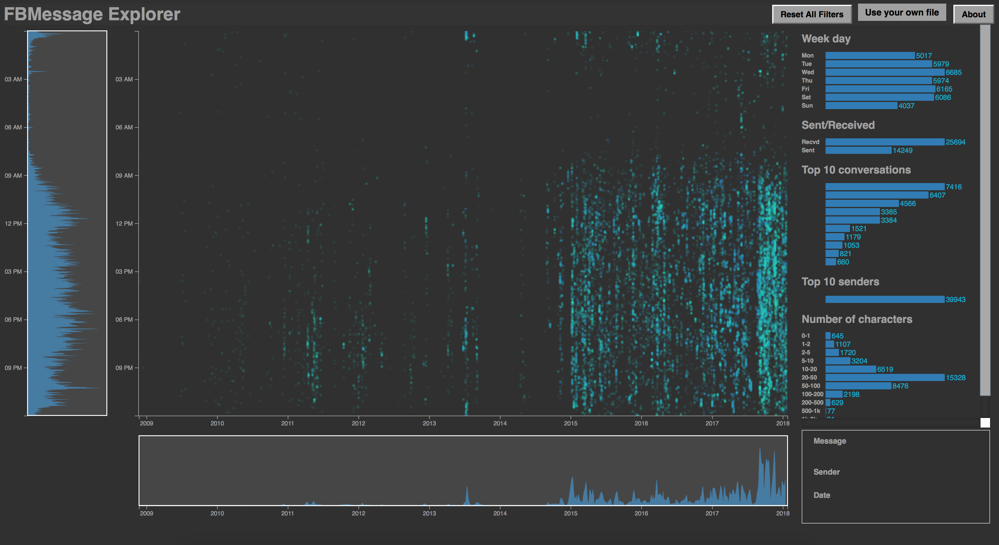
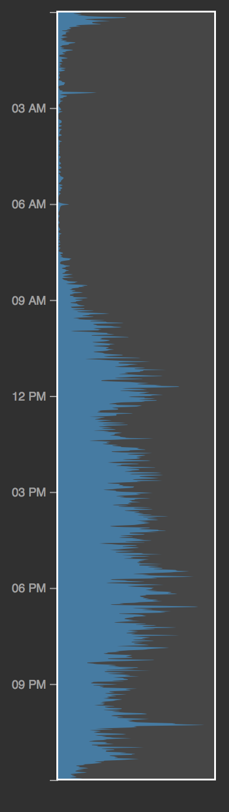
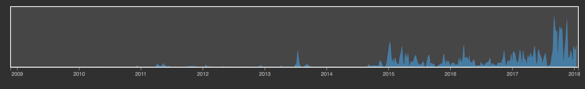
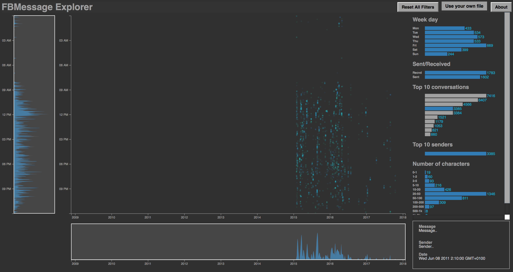
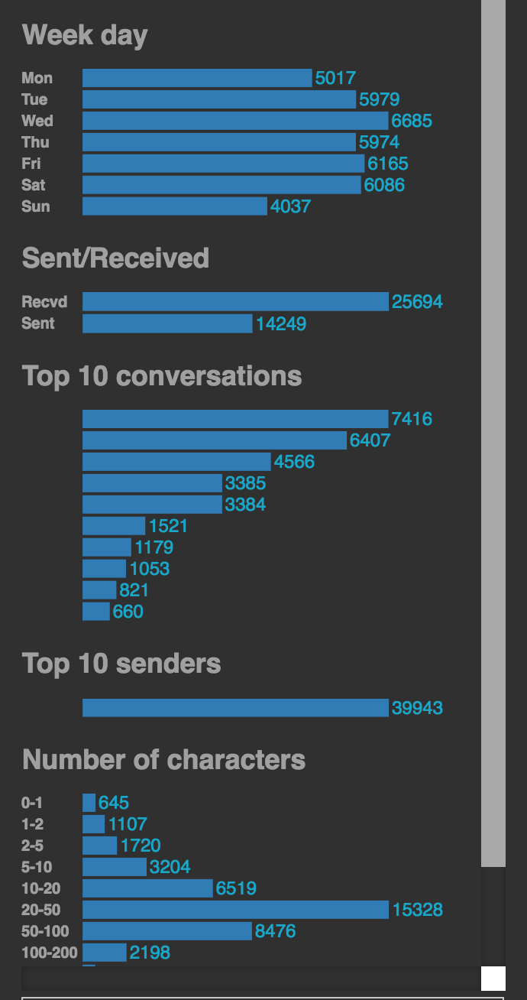
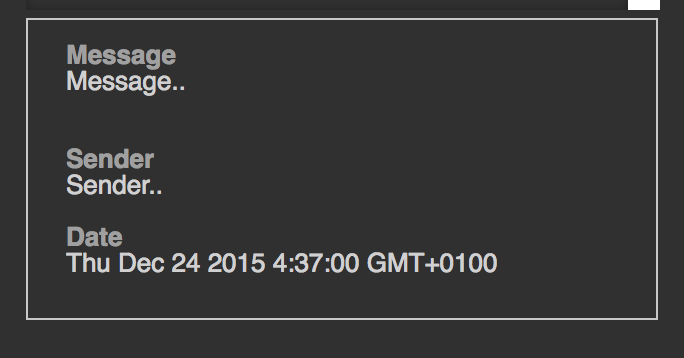

**UPDATE July 27th 2018:**  Just updated the tool so that it is compliant with the revamped the "download your data" feature from Facebook. All preprocessing is now done in browser, no need to use the Python parser anymore.

# FBMessage Explorer: Facebook Messages Visualization

Authors : [Mathilde Reynaud](https://github.com/MathReynaud) | [Augustin Durivault](https://github.com/adurivault)

[Website](https://adurivault.github.io/FBMessage/)

The goal of this project is to allow you to visualize your own Facebook Messages in your browser, with a nice graphical display that gives insights on the number of messages you send and receive, when, to whom, etc.. If you have always been curious about your Facebook messages history, you should find some answers here.

## How does it work ?

### Create your datafile from your Facebook History
First, you should extract your data from Facebook in JSON format [here](https://www.facebook.com/your_information/). Once you've got your data ready, you can go on the [website](https://adurivault.github.io/FBMessage/).

## Video Presentation

There is a presentation [video](https://youtu.be/n8EqF_wfCAE) of this project, and if you are a little bit lost on how to use the tool. The part on retrieving the data, however, is now out of date.

### General design

When you go on the [website](https://adurivault.github.io/FBMessage/), you can see that some data is already displayed. The dataset used is a demo dataset that we put here for the sake of the demonstration, so that you can have an overview of what the tool looks like. Go ahead and play with it a little to get familiar with the tool, but as soon as you have it, use your own file and explore your own data.

What is represented here is quite simple : one point corresponds to one message sent or received. The top of the graph represents the beginning of the day (12:01 a.m.) and the bottom of the graph represents the end of the day (11:59 p.m.).

<table border="0">
  <tr>
    <td>
      
    </td>
  </tr>
</table>

Once you have downloaded your Facebook History,  click on "Explore your own data" and load the ``message`` directory of the archive.

Do not worry, **we do not have any access to your data**. The file is loaded into your browser, but not uploaded to internet, and all computations are performed locally, on you computer. We are aware, however, that this can be very private data, so is you want to be extra cautious, you can shut down your internet connexion once the website is completely loaded, and then select your own data with "Use your own data". Every thing will work properly, and this way you can be confident that we do have access to anything.

Please be patient, loading the data can take a little while, depending on how much you use Facebook Messenger (up to a minute).
Once everything is loaded, you can start exploring: on what day you use Facebook Messenger the most, who are you top contacts in the evening, or in the morning, who sends the longest messages, etc.

## Brush and Zoom

<table border="0">
  <tr>
    <td>
      
    </td>
    <td>
      
    </td>
  </tr>
</table>

On the left-hand side of the screen, and at the bottom you can find sliders that allow you to select the hours and the date you want. Use it to zoom and select only the messages between April 2015 and August 2017 and received/sent between 2am and 6pm for example.
The blue area on the left represents the density of messages depending on the time of the day, whereas the blue area on the bottom represents the density of message depending on the date.
Those densities of messages vary when you select filters. For example if you select a conversation, you may see something like this:

<table border="0">
  <tr>
    <td>
      
    </td>
  </tr>
</table>

You can notice that this conversation was most active between 2015 and mid-2016 and that people spoke the most at 12pm and barely spoke at night.

## Filters

On the right-hand side, you can find some histograms :
- Day of the week
- Sent/Received
- Top 10 conversations
- Top 10 senders
- Length of messages

If you click on any bar of these bar charts, it filters all the data and only keeps the one selected. You can apply multiple filters, and explore some interesting stuff this way.
For instance, if you click on one particular conversation, then the top 10 senders histogram will display who speaks the most **for this conversation**. This is interesting for group conversations.
All of the histograms are also linked to the brush & zoom, which means that if you are between **July 2016 and August 2016**, you will discover who were your 10 contacts for the **summer 2016**, and that maybe you were more active in the evening, and less in the morning.

If you clicked everywhere on the filters and you want to reset everything, just click on **"Reset All Filters"** on the top right.

<table border="0">
  <tr>
    <td>
      
    </td>
  </tr>
</table>

## Message Displayer

In the bottom right-hand corner, you can see the **Message Displayer**. When you mouse over the dots on the central pane, the message under the mouse is displayed here, and you can see basic information:
- The date of the message
- The sender
- The message

If you wonder what is that strange message at 3am on a Monday, here is your answer !

<table border="0">
  <tr>
    <td>
      
    </td>
  </tr>
</table>

## Credits

- [Interactive Data Visualization course (ECL MOS 5.5) - Romain Vuillemot](https://github.com/LyonDataViz/MOS5.5-Dataviz)

- [Facebook Chat Archive Parser](https://github.com/ownaginatious/fbchat-archive-parser). The fbmexplorer that we created uses this library to transform the html messages to a JSON file. Then based on the JSON file we have created our own parser.
